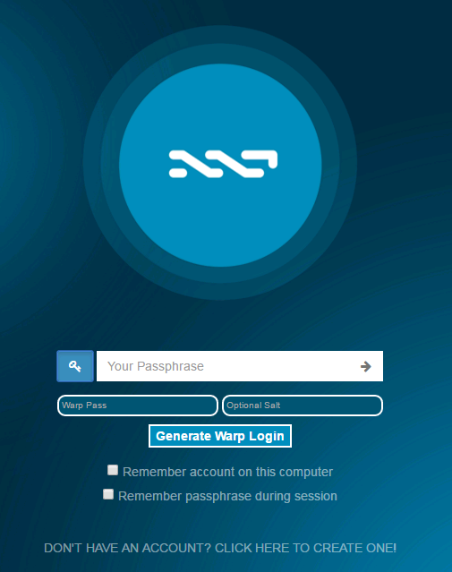
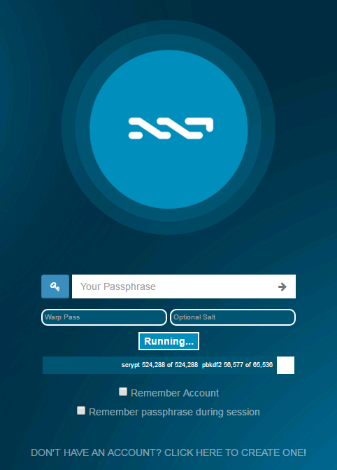
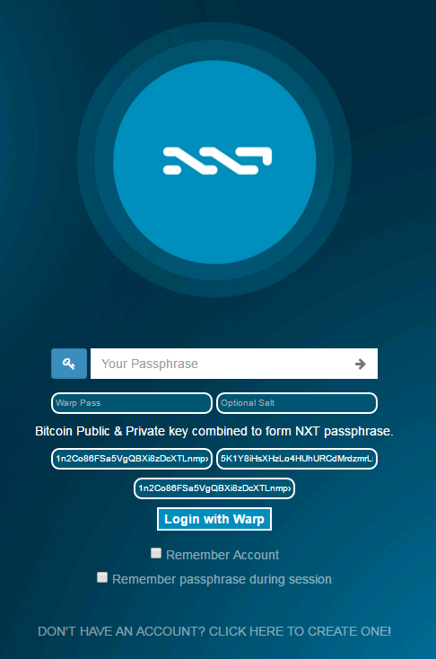
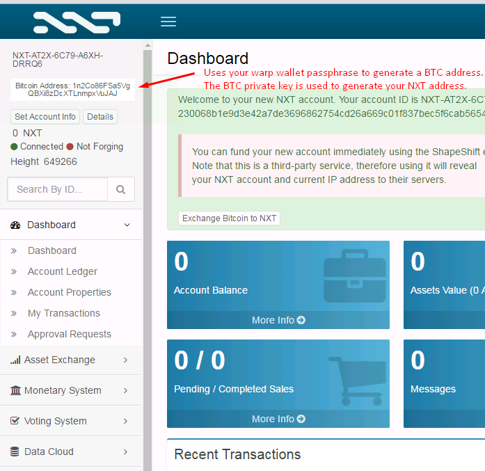

# Warp Wallet NXT Addon - Enhanced Brain Wallets for NXT

Code was inspired and forked from:
https://keybase.io/warp/warp_1.0.8_SHA256_5111a723fe008dbf628237023e6f2de72c7953f8bb4265d5c16fc9fd79384b7a.html

# What is WarpWallet for NXT?

WarpWallet is a deterministic bitcoin address generator. The Bitcoin public+private key address is used as the NXT brain wallet passphrase on the NXT login page. You never have to save or store your private key anywhere. Just pick a really good password - many random words, for example - and never use it for anything else.

This is not an original idea. bitaddress.org's brainwallet is our inspiration.

WarpWallet adds two improvements: (1) WarpWallet uses scrypt to make address generation both memory and time-intensive. And (2) you can "salt" your passphrase with your email address. Though salting is optional, we recommend it. Any attacker of WarpWallet addresses would have to target you individually, rather than netting you in a wider, generic sweep. And your email is trivial to remember, so why not?

# How to Install Warp Wallet for NXT?
- Copy the javascript code (wallet-plugin-code.txt) into the nxt index.html file located in your nxt folder: /html/ui/index.html 
- Search for the following: </body
- Paste the code right before the </body tag

